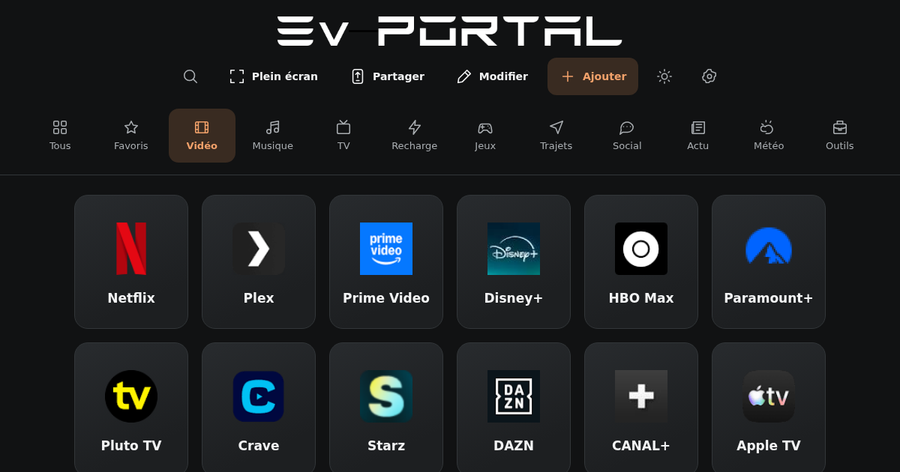

# EvPortal

EvPortal est un lanceur de sites pour l’écran d’une Tesla ou d’un véhicule électrique : de grands raccourcis, un logo et un nom. La navigation reste courte et tactile ; les paramètres et les explications s’ouvrent à la demande.

**[Ouvrir EvPortal](https://drslid.github.io/EvPortal/)** · [Aide](aide.html) · [Signaler un problème](https://github.com/drslid/EvPortal/issues) · [Audit et propositions d’évolution](docs/AUDIT-AMELIORATIONS.md)



Le projet utilise HTML, CSS et JavaScript natifs : aucun compte EvPortal, aucune compilation et aucune dépendance à un CDN pour afficher le tableau. Les sites ouverts depuis les raccourcis conservent leurs propres abonnements, restrictions et conditions d'accès.

## Fonctionnalités

- **Écran épuré** : logo EvPortal d’origine centré, rangées de grands raccourcis centrées et changement de thème directement dans l’en-tête.
- **147 services, 10 catégories** : recharge, navigation, vidéo, musique, télévision, jeux et services pratiques. Le catalogue comprend 35 services à ajouter à la demande ; 112 appartiennent à la sélection initiale avant filtrage par pays, dont 108 pour la France.
- **Vue « Tous » automatique** : les raccourcis les plus ouverts passent en premier ; l’ordre manuel départage les égalités.
- **Personnalisation tactile** : glisser-déposer dans les catégories et les favoris ; création, modification et choix de l’icône des catégories. Un même service peut apparaître dans plusieurs catégories tout en conservant un seul favori et un seul compteur.
- **Suppression directe** : raccourcis et catégories sont supprimés immédiatement, sans fenêtre de confirmation. La réinitialisation complète reste confirmée.
- **Ajout direct** : le bouton « + » donne accès au catalogue, à « Créer un raccourci » et à « Créer une catégorie ».
- **Catégories personnelles** : jusqu’à cinq catégories créées, avec un nom de 16 caractères maximum ; anciennes configurations préservées.
- **Navigation adaptée** : choisissez les catégories à afficher et ouvrez directement vos favoris ; les catégories visibles se répartissent sans défilement horizontal. Masquer une catégorie conserve ses raccourcis dans Tous et Favoris.
- **Catalogue par pays** : le pays choisi adapte les suggestions dans Ajouter ; « Voir tous les pays » donne accès à la sélection complète, sans supprimer les raccourcis existants.
- **Recherche, favoris et thèmes** : accès aux services habituels et choix clair ou sombre. Les raccourcis ouvrent les services dans un nouvel onglet.
- **Huit langues** : anglais, français, espagnol, allemand, italien, russe, arabe et portugais ; interface et aide traduites, noms natifs et drapeaux dans le sélecteur, présentation de droite à gauche en arabe.
- **Sauvegarde locale** : catégories, liens, ordre, favoris, compteurs d’ouverture et préférences restent dans la configuration de l’appareil.
- **Sauvegardes regroupées** : « Exporter une sauvegarde », « Importer une sauvegarde » et la réception depuis un téléphone sont réunis dans Paramètres → Sauvegardes. QR, lien et fichiers JSON restent disponibles.
- **Réception depuis un téléphone** : la Tesla affiche un QR de réception, le téléphone le scanne et envoie ses raccourcis. Le transfert direct nécessite le relais configuré.
- **Import avec aperçu** : anciennes configurations Telegra.ph et fichiers JSON pris en charge ; remplacement après confirmation.
- **Plein écran Tesla** : retour au lancement par la redirection YouTube utilisée par la version historique ; l’API Fullscreen classique reste disponible pour les autres navigateurs.

## Utilisation

1. Choisissez une catégorie et touchez un raccourci pour ouvrir le service dans un nouvel onglet.
2. Dans « Tous », les services les plus ouverts sont placés en premier automatiquement. Pour réorganiser manuellement, choisissez une catégorie ou « Favoris », touchez « Modifier », déplacez les raccourcis puis touchez « Terminer ».
3. Touchez « + » pour choisir un service du catalogue ou créer un raccourci ou une catégorie. Un service marqué « Déjà présent » est déjà dans votre tableau.
4. Pour renommer une catégorie ou changer son icône, utilisez son crayon en mode « Modifier ». Les noms des nouvelles catégories sont limités à 16 caractères et leur nombre à cinq catégories personnelles.
5. Pour afficher un service dans plusieurs catégories, modifiez son raccourci, choisissez sa catégorie principale puis **Autres catégories**. Le service reste unique dans **Tous** et **Favoris** : nom, lien, favori et compteur sont partagés entre ses catégories.

### Choisir son catalogue et son accueil

Dans **Paramètres → Catalogue et accueil**, choisissez votre pays, les catégories affichées et **Ouvrir sur mes favoris**. Le pays adapte les suggestions dans **Ajouter**, et la sélection proposée à une nouvelle installation ; un changement de pays conserve la configuration existante. **Voir tous les pays** affiche le catalogue complet. Masquer une catégorie retire son onglet, sans supprimer ses raccourcis de **Tous** ou **Favoris**.

Ces préférences restent propres à cet appareil : elles ne sont pas ajoutées aux fichiers de sauvegarde, aux pages Telegra.ph ou aux transferts QR. La région explicite du navigateur suggère le pays initial si elle est reconnue ; une langue seule ne détermine pas de pays. Le choix manuel reste prioritaire. Aucune position GPS, permission de géolocalisation ou recherche de pays auprès d’un service tiers n’est utilisée.

### Du téléphone à la Tesla

1. Dans la Tesla, ouvrez **Paramètres → Sauvegardes → Recevoir depuis mon téléphone**.
2. Scannez le QR de réception avec le téléphone.
3. Sur le téléphone, choisissez les raccourcis à envoyer ou une sauvegarde, puis envoyez-les.
4. Vérifiez la proposition reçue sur la Tesla et touchez **Utiliser ces raccourcis**.

Le transfert est chiffré et valable cinq minutes. Les options des paramètres permettent d’annuler le dernier transfert appliqué sur cet appareil. Il s’agit d’un transfert ponctuel, sans synchronisation automatique. Le bouton de réception apparaît lorsque le service de réception est configuré ; son fonctionnement et sa mise en service sont décrits dans [la documentation d’appairage](docs/APPAIRAGE-TELEPHONE-TESLA.md).

### Exporter et gérer mes sauvegardes

Ouvrez **Paramètres → Sauvegardes → Exporter une sauvegarde**, puis touchez **Créer ma sauvegarde**. L’option **Nommer la sauvegarde** est facultative. Le résultat présente un QR code et **Copier le lien**, sans adresse technique ni code à saisir dans ce dialogue. Les QR codes et liens de sauvegarde pointent vers l’adresse publique d’EvPortal.

**Mes sauvegardes** charge l’historique du compte présent dans ce navigateur dès son ouverture. Touchez un nom pour retrouver le QR correspondant. La corbeille efface le contenu de la sauvegarde sans confirmation ; en cas d’échec, la ligne reste visible pour réessayer. Telegra.ph ne propose pas de suppression définitive de page par son API : EvPortal remplace les données par un message neutre, efface les informations d’auteur et remplace le titre, puis masque l’entrée. L’adresse de la page continue d’exister.

Les nouveaux liens utilisent un identifiant aléatoire difficile à deviner. Une sauvegarde Telegra.ph reste **publique et non chiffrée** ; toute personne disposant du lien peut lire son contenu tant qu’il n’est pas effacé. Le jeton du compte et le reste du stockage du navigateur ne sont pas publiés. Les anciennes sauvegardes restent accessibles avec leur adresse d’origine jusqu’à leur effacement explicite.

Dans le même groupe **Sauvegardes**, **Importer une sauvegarde** affiche les sauvegardes disponibles dans ce navigateur. Choisissez-en une, vérifiez l’aperçu puis confirmez. **Plus d’options** permet aussi de saisir un ancien code ou lien, ou de choisir un fichier JSON.

Le téléchargement JSON se trouve dans **Exporter une sauvegarde → Plus d’options**. Il permet aussi de conserver les configurations qui dépassent les limites du transfert direct ou de Telegra.ph.

### Anciennes configurations

Les anciennes clés `pages` et les données de leurs catégories sont reprises automatiquement lorsqu'aucune configuration récente n'existe. Les clés historiques sont conservées ; les nouvelles modifications utilisent `evportal.state.v2`. Les anciennes adresses connues sont actualisées. Un ancien nom de service est corrigé uniquement s’il correspond exactement au libellé historique, pour préserver vos noms personnalisés.

La limite de cinq catégories personnelles et les noms courts encadrent la création dans l’interface. Les anciennes catégories déjà plus nombreuses ou portant un nom plus long ne sont pas supprimées ou tronquées lors de la reprise. La validation des anciennes sauvegardes conserve sa limite globale de 50 catégories.

L'import comprend les anciens fichiers organisés comme `{ "pages": ["cinema"], "cinema": [...] }` et les dictionnaires de catégories. Pour un ancien lien Telegra.ph, ouvrez l'import dédié et renseignez son identifiant ou son URL. Un lien EvPortal contenant `?code=...` ou `?config=...` prépare le formulaire : la configuration n'est ni téléchargée ni appliquée automatiquement.

Le partage utilise l’API Telegra.ph après un clic explicite. Le compte historique est repris lorsqu’il est disponible ; la liste « Mes sauvegardes » permet de retrouver ses pages. Une nouvelle publication crée une adresse aléatoire, puis y enregistre la configuration et le nom choisi avant de fournir le lien et le QR code. Si le navigateur ne peut pas générer cet identifiant de façon sûre ou si Telegra.ph ne le conserve pas lors de la création de l’adresse, la publication de la configuration est interrompue. Le contenu est limité à 64 Kio UTF-8 par Telegra.ph ; une configuration trop volumineuse peut être sauvegardée en JSON. Les pages publiées ne sont pas supprimées par une réinitialisation locale.

### Navigateur Tesla et accès aux services

EvPortal ouvre des sites web. La présence d'un service dans le catalogue indique un lien utile ; elle ne garantit pas la lecture vidéo, l'authentification ou la compatibilité avec chaque écran Tesla. Le navigateur, la version logicielle, les restrictions régionales, la connexion et les protections multimédias du service peuvent limiter son fonctionnement.

Tesla indique que les options de divertissement dépendent du véhicule et de la région et présente le Théâtre pour un usage en stationnement, avec une connexion adaptée. Consultez le [manuel Tesla correspondant au véhicule](https://www.tesla.com/ownersmanual/modely/fr_fr/GUID-79A49D40-A028-435B-A7F6-8E48846AB9E9.html). Utilisez le portail de divertissement à l'arrêt.

Dans une Tesla, le bouton plein écran utilise le lancement via YouTube avec une URL de retour vers EvPortal, comme dans la version historique. Choisissez « Accéder au site » ou « Go to site » sur YouTube pour revenir au portail en mode Théâtre. Le même parcours est décrit par [myTesla](https://mytesla.nu/). Si le navigateur n’est pas reconnu comme une Tesla, l’entrée « Ouvrir le mode Théâtre Tesla » reste accessible dans Paramètres.

Ce mécanisme dépend du navigateur et du logiciel du véhicule ; un essai sur Tesla est nécessaire pour valider son résultat. Il ne s’agit pas d’une API officielle Tesla. Sur les autres navigateurs, le bouton utilise l’[API Fullscreen](https://developer.mozilla.org/en-US/docs/Web/API/Fullscreen_API) lorsqu’elle est disponible. L’ajout à l’écran d’accueil dépend également du navigateur. Le manifeste ne fournit pas de mode hors connexion complet : les services externes nécessitent Internet et aucun service worker de cache n’est inclus.

## Données et confidentialité

La configuration est stockée dans le `localStorage` du navigateur, sous la clé `evportal.state.v2`. Les informations du compte Telegra.ph restent séparées sous `evportal.telegraph.v1`. Effacer les données du site ou changer de navigateur peut faire perdre la personnalisation : un partage Telegra.ph ou un export JSON permet de la retrouver. Si le stockage est bloqué ou une sauvegarde est illisible, un message explique la situation et l'export reste disponible pour préserver la session.

La langue se choisit dans Paramètres et reste enregistrée sur cet appareil, séparément de la configuration partagée. Le pays du catalogue, les catégories affichées et l’accueil Favoris utilisent leur propre clé `evportal.preferences.v1`, indépendamment de la langue. Au premier lancement, la langue du navigateur est utilisée lorsqu’elle est prise en charge. Changer de langue adapte les libellés, les dialogues, les erreurs et l’aide ; vos noms de raccourcis et de catégories personnels restent conservés. Le sélecteur affiche les langues dans leur écriture d’origine, accompagnées de drapeaux. Les deux modes de thème disponibles sont clair et sombre.

Le classement « Tous » utilise un compteur d’ouvertures par raccourci, associé à son identifiant et conservé après rechargement. Ce compteur reste dans la configuration locale et ses sauvegardes ; aucun service d’analyse d’audience n’est nécessaire. Le glisser-déposer est désactivé dans cette vue automatique. Les catégories et les favoris gardent leur ordre manuel.

Les logos du catalogue sont embarqués dans le dépôt, sans requête de favicon à un tiers pendant l’utilisation. Le portail n’intègre aucun outil d’analyse d’audience ni publication automatique de configuration. Publier, importer ou consulter ses partages Telegra.ph déclenche une requête vers ce service après une action explicite. Le jeton du compte n’est ni affiché dans le partage ni inclus dans l’export. Ouvrir un raccourci transmet la navigation au site choisi, qui applique sa propre politique de confidentialité. L'hébergeur du portail peut également traiter les informations techniques d'une requête web.

En mode « Modifier », supprimer un raccourci ou une catégorie prend effet immédiatement. La suppression d’une catégorie conserve les services qui appartiennent encore à une autre catégorie ; ceux qui n’appartiennent qu’à la catégorie supprimée sont retirés. La réinitialisation complète demande toujours confirmation et remplace uniquement l’état EvPortal récent. L’application n’efface pas l’ensemble du stockage de l’origine, qui peut être partagé avec d’autres projets GitHub Pages.

## Développement local

Pour tester **le portail et la réception QR réelle** sur cet ordinateur, utilisez Node.js 22 ou supérieur, puis, depuis la racine du dépôt :

```bash
npm ci --prefix relay
npm run dev
```

Ouvrez **http://127.0.0.1:4187/** et choisissez **Paramètres → Sauvegardes → Recevoir depuis mon téléphone**. Le serveur configure le relais local dans la réponse `/js/config.js`, sans modifier le fichier destiné à la publication. Il démarre Wrangler sur le port 8787 si nécessaire, ou vérifie un relais EvPortal déjà présent : origine autorisée, création d’une session, réception et suppression. Le bouton fonctionne dans un navigateur ordinaire disposant de Web Crypto ; aucun remplacement de configuration par Playwright n’est nécessaire. [Développement local Cloudflare](https://developers.cloudflare.com/workers/local-development/).

`Ctrl+C` arrête le serveur et uniquement le Worker qu’il a lui-même démarré. Un relais préexistant est conservé. Si un port est occupé par un autre programme, le démarrage s’interrompt sans arrêter ce programme. Pour choisir d’autres ports : `npm run dev -- --port 4188 --relay-port 8788`.

Ce mode écoute uniquement sur la boucle locale. Le QR de réception utilise l’adresse de l’aperçu courant : **127.0.0.1/localhost désigne le téléphone lui-même après un scan sur téléphone**, et ne permet donc pas de joindre le PC. Pour tester deux navigateurs sur le même ordinateur, ouvrez l’adresse décodée du QR dans un second profil ou une fenêtre privée. Pour un vrai téléphone et une Tesla, le portail et le relais doivent être accessibles aux deux appareils en HTTPS, avec les origines du portail autorisées côté relais ; le simple remplacement de localhost par une IP réseau en HTTP ne fournit pas le contexte sécurisé nécessaire au chiffrement. Les liens de sauvegarde Telegra.ph continuent à utiliser l’adresse publique du portail.

Pour afficher uniquement les fichiers statiques, sans relais de réception local, `python3 -m http.server 8080` reste possible. Ouvrez alors `http://localhost:8080/` ; cette commande sert la configuration publique telle quelle. Un aperçu local peut différer de la version publiée.

```text
index.html                 Tableau de raccourcis et métadonnées SEO
aide.html                  Explications, transfert téléphone et mode Théâtre
css/styles.css             Interface responsive et thèmes
js/catalog.js              Catalogue de services et corrections d’anciennes URL
js/icons.js                Correspondance entre services et logos embarqués
js/i18n.js                 Langue, traduction des éléments et direction du texte
js/locales/                Textes sources JSON des huit langues
js/translations.js         Traductions embarquées générées depuis les JSON
js/state.js                Validation, migrations et modèle de sauvegarde
js/preferences.js          Pays, accueil et catégories affichées propres à cet appareil
js/script.js               Raccourcis, déplacement tactile, recherche et dialogues
js/telegraph.js            Sauvegardes Telegra.ph, historique et effacement
js/pairing.js              Transfert chiffré téléphone → écran récepteur
js/config.js               Adresse du service de réception
js/tesla.js                Redirection Théâtre et plein écran classique
js/vendor/                 QRCode.js, SortableJS et leurs licences
scripts/check-links.mjs    Vérification HTTP du catalogue depuis Node.js
scripts/fetch-icons.mjs    Actualisation ponctuelle des logos du catalogue
tests/state.test.js        Tests du stockage et des données importées
scripts/browser-smoke.cjs  Recette navigateur et contrôles d’accessibilité
scripts/catalog-smoke.cjs  Services partagés, préférences et migrations dans le navigateur
scripts/interaction-smoke.cjs Déplacement tactile/clavier et parcours Tesla
package.json               Outils de vérification, sans dépendance de production
img/                       Logos, icônes et manifeste
robots.txt                 Directives à exposer à la racine de l'hôte
sitemap.xml                Pages publiques indexables
README.md                  Utilisation et contribution
docs/                      Audit, sources et propositions
```

### Vérifications de développement

Avec Node.js 20 ou plus récent, sans installer de dépendance :

```bash
node --test tests/*.test.js
node scripts/check-links.mjs --output /tmp/evportal-links.json
```

La première commande vérifie les données, les catégories, les compteurs, les sauvegardes et le parcours plein écran. La seconde consulte les sites externes pour inventorier les réponses HTTP et produit un rapport local ; elle ne teste pas la lecture multimédia.

Pour la recette automatisée dans Chromium et les contrôles d'accessibilité, installez les outils de développement :

```bash
npm ci
npm ci --prefix relay
npx playwright install chromium
npm test
npm run build:locales
npm run test:browser
npm run test:catalog
npm run test:interactions
npm run test:share
npm run test:pairing
npm run test:relay
npm run test:i18n
```

Les scripts navigateur démarrent leur propre serveur local temporaire. La recette d’interactions peut aussi être lancée avec `node scripts/interaction-smoke.cjs`. Sur une machine Linux qui ne possède pas les bibliothèques nécessaires à Chromium, utilisez `npx playwright install --with-deps chromium`. Playwright et axe servent uniquement aux vérifications ; les bibliothèques utilisées par le portail sont embarquées dans le site. Complétez cette recette par un essai sur le véhicule visé.

Le relais nécessite Node.js 22 ou supérieur. Pour tester le transfert complet avec le vrai moteur Cloudflare local, démarrez `npm run dev`, puis lancez `npm run test:pairing:live` dans un autre terminal. Cette recette ouvre deux navigateurs isolés, décode le QR, vérifie l’envoi chiffré, le refus d’une écriture lorsque le stockage est plein, la validation explicite et l’annulation après rechargement ou changement d’onglet. Elle vérifie aussi le dialogue de partage sur mobile et en arabe. Elle utilise la configuration fournie par le serveur de développement et ouvre directement l’adresse décodée du QR, sans substitution de configuration ou d’URL ; la configuration publique reste intacte.

### Vérifier la publication

Après publication sur GitHub Pages, `npm run test:production -- --frontend-only` contrôle le catalogue, les réglages et les sauvegardes réellement servis, et indique si la réception QR est inactive. Lorsque le relais public est configuré, `npm run test:production` vérifie un transfert chiffré avec deux navigateurs isolés et des données synthétiques : QR suivi sans modification, aperçu, application et suppression de la session. Aucune sauvegarde Telegra.ph réelle n’est publiée.

### Faire évoluer le catalogue

La première révision de septembre 2026 comprenait 22 destinations actualisées, 18 nouveaux raccourcis et 4 retraits de la sélection initiale. Le catalogue révisé regroupe les services présents dans plusieurs catégories, distingue les ajouts facultatifs et adapte la sélection au pays. Consultez [le détail, les sources et les limites du contrôle des liens](docs/LIENS.md).

Modifiez `js/catalog.js` en conservant des identifiants stables pour les catégories et les services. Préférez l’adresse officielle du service et ajoutez une description utile à la recherche et à la maintenance, sans l’afficher dans les raccourcis. Lancez `node scripts/fetch-icons.mjs` pour récupérer les logos manquants ; `--refresh` actualise également les existants. Les sources et conditions de maintenance figurent dans [le dossier des icônes](img/services/README.md). Quand un ancien lien change, documentez la correction et utilisez les remplacements d'URL prévus par le catalogue.

Une redirection, une page d'authentification, une restriction géographique ou une réponse HTTP `403` ne prouvent pas qu'un service a fermé. Documentez séparément l'accessibilité du lien et les essais de lecture sur un véhicule réel.

Une mise à jour ne doit pas réinsérer des raccourcis qu'une personne a supprimés. Vérifiez les parcours avec une configuration neuve et avec une ancienne configuration personnalisée avant de publier.

### Faire évoluer les traductions

Les textes de l’interface, du partage et de l’aide sont séparés dans `js/locales/`. Chaque famille de fichiers possède les mêmes clés dans les huit langues. Le navigateur charge `js/translations.js` depuis le site ; aucun service externe de traduction n’est appelé. Les annotations `data-i18n` traduisent le texte, et leurs variantes les titres, descriptions et libellés accessibles. Les noms et liens personnalisés ne sont pas remplacés par des traductions.

Après modification des JSON, lancez `npm run build:locales` ou `node scripts/build-locales.cjs` pour régénérer le fichier embarqué. La génération vérifie la présence des mêmes clés et paramètres dans les huit langues. `npm run test:i18n` vérifie l’interface, les dialogues, le thème, la persistance et l’aide dans ces langues, sur six largeurs.

Vérifiez les libellés longs, le passage de gauche à droite et de droite à gauche, les dialogues ouverts lors d’un changement de langue et la conservation du choix après rechargement.

### Format de sauvegarde

Le JSON exporté utilise `version: 2`, une `catalogVersion`, le `theme`, la catégorie active `activeCategory`, l’ordre manuel `shortcutOrder` et une liste `categories`. Chaque catégorie contient son `id`, son `label`, son `icon`, sa `description` et ses `shortcuts`. Chaque raccourci possède un identifiant, un nom, une URL et ses métadonnées, dont l’état de favori et le compteur `clickCount`. Un service du catalogue conserve son `serviceId`, et `categoryIds` décrit ses catégories d’appartenance. Il n’est enregistré qu’une fois dans la collection d’une catégorie propriétaire ; les autres catégories l’affichent par appartenance. Les compteurs absents des anciens formats sont initialisés à zéro.

Le format exact à réutiliser est celui produit par le bouton d'export. Les données importées sont validées avant application ; les URL doivent utiliser HTTP ou HTTPS, sans identifiants dans l’adresse. Les imports JSON sont limités à 2 Mo, 50 catégories et 5 000 raccourcis. La publication Telegra.ph possède une limite distincte de 64 Kio pour son contenu sérialisé. [Référence de l’API Telegra.ph](https://telegra.ph/api#createPage).

## Hébergement et référencement

Déployez les fichiers statiques sur GitHub Pages ou un hébergeur HTTPS. L'adresse publique de référence est actuellement `https://drslid.github.io/EvPortal/`.

Lors d'un changement de domaine ou de chemin, actualisez ensemble les URL canoniques, Open Graph et JSON-LD dans `index.html`, l'adresse du `sitemap.xml`, la directive Sitemap de `robots.txt` et l'icône historique dans `img/browserconfig.xml`. Les chemins du manifeste sont relatifs à son dossier `img/`.

**Particularité GitHub Pages :** `https://drslid.github.io/EvPortal/robots.txt` est dans un sous-dossier. Google attend le fichier à la racine de l'hôte, `https://drslid.github.io/robots.txt`. Placez-y la directive Sitemap si cet emplacement est administrable, ou soumettez directement le sitemap dans Search Console. Le fichier du dépôt seul ne configure pas le robot de tout l'hôte. [Règle officielle Google](https://developers.google.com/crawling/docs/robots-txt/create-robots-txt).

Après déploiement, inspectez l'URL canonique dans Search Console, soumettez le sitemap et mesurez les résultats réels. La feuille de route SEO et les vérifications détaillées figurent dans [l'audit](docs/AUDIT-AMELIORATIONS.md).

## Évolutions proposées

Les prochaines améliorations doivent préserver l’écran de raccourcis :

- Annuler la dernière suppression ou le dernier import.
- Régler discrètement la taille des raccourcis.
- Signaler un lien inaccessible depuis son raccourci.
- Ajouter des profils simples « quotidien » et « voyage » si les essais en montrent l’utilité.

Le contrôle régulier des liens relève de la maintenance. Le plein écran, le déplacement tactile et le transfert téléphone → Tesla restent à valider sur le véhicule visé. Les réglages avancés et l’aide restent à l’écart de l’écran principal. Voir [l’audit révisé et les priorités](docs/AUDIT-AMELIORATIONS.md).

## Contribution et licence

Signalez un lien obsolète ou proposez une fonctionnalité dans les [issues GitHub](https://github.com/drslid/EvPortal/issues). Pour un problème de navigateur, précisez le modèle d'appareil, la version du navigateur ou du logiciel Tesla, la région et les étapes pour le reproduire.

Pour une contribution au code, créez une branche, effectuez vos modifications et ouvrez une pull request décrivant le problème résolu et les vérifications effectuées. Le projet est distribué sous [licence MIT](LICENSE). EvPortal est un projet indépendant, sans affiliation avec Tesla ou les services référencés.

Le [transfert par QR vers la Tesla](docs/APPAIRAGE-TELEPHONE-TESLA.md) utilise un relais temporaire distinct des sauvegardes Telegra.ph. Son activation dépend de la configuration et du déploiement de ce relais.
