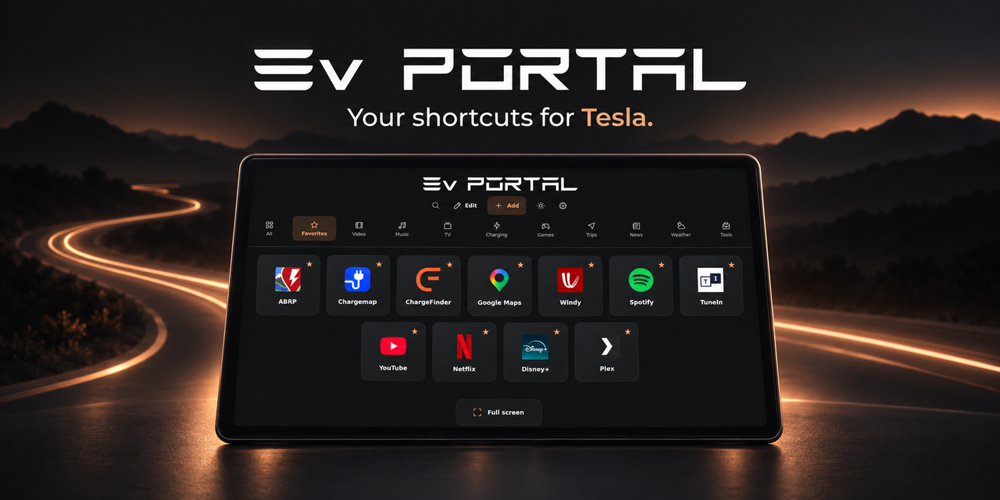
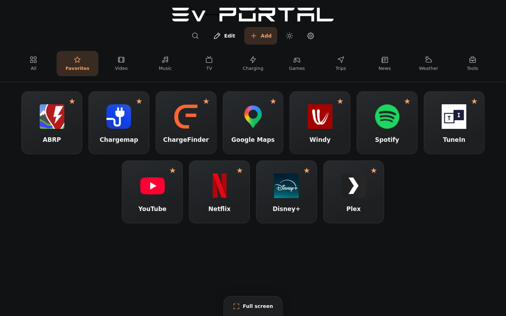

# EvPortal

A simple shortcut dashboard for the Tesla browser. Keep charging, maps, music and entertainment a tap away, and personalize your shortcuts from your phone or computer.

## [Open EvPortal →](https://drslid.github.io/EvPortal/en/)

[User guide](https://drslid.github.io/EvPortal/en/aide.html) · [Guide français](https://drslid.github.io/EvPortal/fr/aide.html) · [Report an issue](https://github.com/drslid/EvPortal/issues)

[](https://drslid.github.io/EvPortal/en/)

*Project illustration.*

Free, open source and usable without an EvPortal account. The dashboard runs on HTML, CSS and JavaScript, with its fonts, icons and interface libraries served locally.

## What you can do

| Feature | How it works |
| --- | --- |
| Common catalogue | 147 services: 112 in the initial selection and 35 optional additions. The same catalogue is available to everyone. |
| Direct controls | Open **+** to add or remove services, create a shortcut or create a category. |
| Personal organization | Drag shortcuts in categories or Favorites. A service can belong to several categories while keeping one favorite status and one usage counter. |
| Custom categories | Create up to five personal categories and choose from 25 icons. Existing configurations remain supported. |
| Quick access | Search across shortcuts, open on Favorites, hide category tabs and use **All** to see your most-opened services first. |
| Display choices | Dark by default, an optional light theme, **Standard / Small** shortcuts and optional shortcut names. |
| Backups | Save JSON files or public Telegra.ph links, keep a local backup library, restore explicitly and undo the last restoration. |
| Phone transfers | Send or receive an encrypted backup by QR. Sessions last five minutes and use a separate temporary relay. |



*Actual web interface captured in a desktop browser.*

## Make the screen yours

In **Settings → Appearance**, choose **Standard** or **Small** shortcuts and switch **Show names** on or off. Standard size and visible names are the defaults. These settings stay on the device, alongside your home-screen and category-visibility choices; backups do not replace them. [Preview the compact view without names](img/evportal-compact.png).

The theme button is always available in the header. A saved light-theme choice is respected.

## Back up, then restore when ready

**Add saves a backup. Restore applies it.** Importing a code, a link, a JSON file or a phone transfer leaves the current dashboard unchanged. Open **My backups → Restore** to select and apply a saved configuration.

For a phone transfer, choose **Send** or **Receive**, scan the QR and follow the prompts. QR transfer requires the configured relay and a supported secure browser connection. Creating a Telegra.ph code or link is a separate action; those pages are public and unencrypted. [Transfer details](docs/APPAIRAGE-TELEPHONE-TESLA.md) · [Detailed usage, in French](docs/UTILISATION.md)

## Guides in eight languages

[🇬🇧 English](https://drslid.github.io/EvPortal/en/aide.html) · [🇫🇷 Français](https://drslid.github.io/EvPortal/fr/aide.html) · [🇪🇸 Español](https://drslid.github.io/EvPortal/es/aide.html) · [🇩🇪 Deutsch](https://drslid.github.io/EvPortal/de/aide.html)<br>
[🇮🇹 Italiano](https://drslid.github.io/EvPortal/it/aide.html) · [🇷🇺 Русский](https://drslid.github.io/EvPortal/ru/aide.html) · [🇸🇦 العربية](https://drslid.github.io/EvPortal/ar/aide.html) · [🇵🇹 Português](https://drslid.github.io/EvPortal/pt/aide.html)

The Arabic interface supports right-to-left layout. Personal shortcut and category names stay as you wrote them.

## Run locally

**Node.js 24 is recommended; Node.js 22 or newer is required.** From the repository root:

```bash
npm ci
npm ci --prefix relay
npm run dev
```

Open **http://127.0.0.1:4187/**. This starts the portal with a real local relay on port 8787. A phone cannot reach your computer through a `localhost` QR: testing across devices requires HTTPS addresses accessible to both.

For browser checks, install Chromium, then build and verify:

```bash
npx playwright install chromium
npm run build:seo
npm run check:seo
npm test
npm run test:browser
```

[Development and test commands](docs/DEVELOPMENT.md) · [SEO and deployment](docs/SEO-MULTILINGUE.md) · [Relay documentation](relay/README.md)

## Browser support and privacy

Use entertainment while parked. Tesla fullscreen follows the YouTube return-to-site route; other browsers use the standard Fullscreen API. Vehicle software and external services can affect availability, sign-in and playback. The web screenshots above are not a physical Tesla test.

Shortcuts, usage counts and preferences stay in browser storage. EvPortal includes no audience analytics. Telegra.ph is contacted for explicit backup actions; QR transfers use the configured relay. External services apply their own policies. Keep a JSON copy before clearing site data. There is no offline mode.

## Contribute

[Report a broken link or suggest an improvement](https://github.com/drslid/EvPortal/issues), or open a pull request with the change and its validation. For browser problems, include the device, browser or Tesla software version and steps to reproduce.

[Catalogue maintenance](docs/LIENS.md) · [Local icon provenance](img/services/README.md) · [Development guide](docs/DEVELOPMENT.md)

Code is released under the [MIT licence](LICENSE). EvPortal is independent and is not affiliated with Tesla or the listed services. Bundled third-party assets retain their respective licences.
