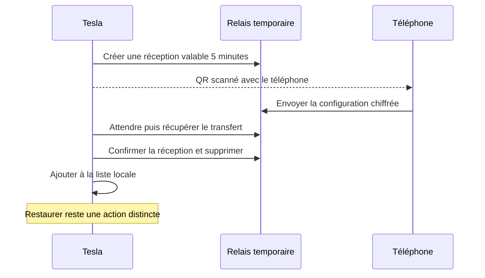

# Échanger des sauvegardes entre le téléphone et la Tesla

**Le relais et son protocole sont implémentés dans [relay/](../relay/README.md).** Les actions **Paramètres → Sauvegardes → Téléphone → Envoyer / Recevoir** dépendent de sa configuration et de sa disponibilité. Le téléphone scanne un QR affiché sur l’autre écran ; le transfert fonctionne dans les deux sens. La création d’un code ou lien EvPortal reste un parcours distinct, sans QR.

## Recevoir depuis le téléphone

1. **Tesla :** ouvrir **Paramètres → Sauvegardes → Téléphone → Recevoir** ; un QR de réception apparaît.
2. **Téléphone :** scanner le QR, puis choisir ses raccourcis actuels ou une sauvegarde.
3. **Téléphone :** toucher **Envoyer**.
4. **Tesla :** après réception, toucher **Ajouter** pour conserver la sauvegarde dans **Sur cet appareil**.

## Envoyer vers le téléphone

1. **Tesla :** ouvrir **Paramètres → Sauvegardes → Téléphone → Envoyer** ; un QR donne accès à la sauvegarde chiffrée préparée pour le téléphone.
2. **Téléphone :** scanner le QR, puis toucher **Ajouter** après réception pour conserver la sauvegarde localement.

Dans les deux sens, **Ajouter ne remplace aucun raccourci**. Pour utiliser le contenu reçu, ouvrir **Mes sauvegardes → Restaurer**, choisir la sauvegarde puis toucher **Restaurer**. La dernière restauration peut être annulée dans les options des paramètres. La liste de sauvegardes et les préférences propres à chaque appareil restent séparées de la configuration active.

Les deux appareils doivent disposer d’un accès Internet, sans obligation d’utiliser le même réseau Wi-Fi. Le QR utilise l’adresse du portail actuellement ouvert, sans reprendre les paramètres d’un ancien ajout. Le téléphone rejoint ainsi la même version et le même relais. Les codes et liens de sauvegarde Telegra.ph utilisent l’adresse publique d’EvPortal.

### Essai de développement

Depuis la racine du projet, `npm run dev` sert le portail avec un vrai relais local configuré. `npm run test:pairing:live` ouvre deux navigateurs isolés, décode le QR et suit directement son adresse, sans remplacer `js/config.js` ni réécrire le lien. Un serveur statique seul ne configure pas le relais : si `pairingRelayURL` est vide, les actions de transfert restent masquées.

L’adresse `localhost` convient à deux navigateurs sur le même ordinateur. Pour scanner depuis un téléphone physique ou recevoir dans la Tesla, le portail et le relais doivent être accessibles en HTTPS par les deux appareils ; l’adresse locale de l’ordinateur ne suffit pas.

## Deux options

| Option | Intérêt | Limites |
|---|---|---|
| **Relais éphémère dédié, recommandé** | Réception automatique, droits limités à un transfert, expiration contrôlée | Une petite API supplémentaire à déployer et maintenir |
| **Page Telegra.ph comme boîte de réception** | Réutilise le service de sauvegarde actuel | Droits d’écriture au niveau du compte, lecture publique, absence d’expiration et de consommation unique documentées |

GitHub Pages sert des fichiers HTML, CSS et JavaScript : il ne fournit pas lui-même le canal de retour entre les appareils. Un QR transporte l’adresse de la session ; il ne suffit pas à acheminer ensuite les données du téléphone vers la voiture. [Documentation GitHub Pages](https://docs.github.com/en/pages/getting-started-with-github-pages/what-is-github-pages)

## Architecture retenue

Un Worker avec un Durable Object SQLite gère chaque session. Elle a une **durée fixe de cinq minutes**, un identifiant imprévisible et deux jetons aux droits distincts : déposer une fois, ou recevoir et supprimer. Leur transmission dépend du sens choisi. Seules les empreintes des jetons sont stockées. Aucun jeton de compte Telegra.ph ne figure dans le QR. Taille des données et tentatives sont limitées ; chaque requête contrôle l’expiration. Un accusé de réception supprime le transfert actif, complété par un nettoyage programmé. [TTL des Durable Objects](https://developers.cloudflare.com/durable-objects/examples/durable-object-ttl/)

Le chiffrement **AES-GCM 256 bits avant transfert** utilise une clé générée sur la Tesla, transmise au téléphone dans le fragment du lien QR et conservée uniquement côté navigateurs. Le relais stocke le contenu chiffré, jamais cette clé. La configuration est limitée à 64 Kio avant chiffrement ; au-delà, utiliser un fichier JSON. La disponibilité de Web Crypto et le parcours complet restent à vérifier **sur une Tesla physique**. [Web Crypto](https://www.w3.org/TR/webcrypto/#aes-gcm)

Les fragments correspondent à deux droits différents :

| Fragment du QR | Action ouverte sur le téléphone | Droit transmis |
|---|---|---|
| `#receive=…` | Choisir puis envoyer une sauvegarde vers l’écran récepteur | `sendToken` : déposer le contenu chiffré |
| `#download=…` | Recevoir la sauvegarde préparée par l’écran émetteur | `receiveToken` : lire puis supprimer le transfert |

Chaque fragment transporte aussi l’identifiant de session, sa date d’expiration et la clé de chiffrement. Le client retire le fragment de la barre d’adresse avant les requêtes et ne le stocke pas dans la bibliothèque. Le dépôt précède l’affichage du QR `#download`. Après déchiffrement et validation en mémoire, le client accuse réception auprès du relais et propose **Ajouter**. L’écriture de la sauvegarde locale reste explicite, puis **Restaurer** est une opération séparée sur la configuration active.

Une interrogation HTTP espacée, arrêtée à expiration, assure la réception. Les transactions du Durable Object empêchent deux dépôts distincts concurrents ; une répétition identique reste acceptée pour les reprises réseau. Workers KV seul est moins adapté : sa cohérence différée peut retarder les changements de plus de 60 secondes. [Cohérence de KV](https://developers.cloudflare.com/kv/concepts/how-kv-works/)

## Pourquoi conserver Telegra.ph comme sauvegarde

`getPage` est accessible sans secret, tandis que `editPage` exige le jeton du compte. L’API ne documente ni droit limité à une page, ni suppression, ni expiration des pages, ni quota chiffré de requêtes. Sa limite de contenu est de 64 Ko. Le délai de cinq minutes de `auth_url` concerne la connexion au compte. Confier son jeton au téléphone pour modifier une boîte commune n’est pas recommandé ; le garder sur un serveur nécessiterait de nouveau un backend. [API Telegra.ph](https://telegra.ph/api)

Le parcours s’inspire du QR d’appairage décrit par OAuth Device Authorization, sans nécessiter un système OAuth complet pour ce simple transfert. WebRTC ajouterait un échange de signalisation et potentiellement des relais STUN/TURN : il ne supprime pas ce besoin de communication. [RFC 8628](https://www.rfc-editor.org/rfc/rfc8628.html#section-3.3.1), [documentation WebRTC](https://webrtc.org/getting-started/peer-connections)
