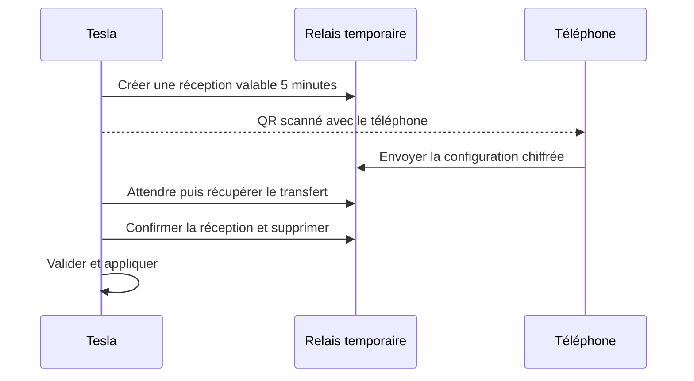

# Envoyer ses raccourcis du téléphone vers la Tesla

**Le relais et son protocole sont implémentés dans [relay/](../relay/README.md).** Leur disponibilité dans le portail dépend du déploiement du Worker et de la configuration de son adresse. Le parcours permet de transférer une configuration sans saisir d’adresse ni de code dans la Tesla, au moyen d’un QR de réception et d’un relais temporaire. Les sauvegardes Telegra.ph existantes restent disponibles.

## Quatre gestes, aucune saisie

1. **Tesla :** toucher « Recevoir du téléphone » ; un QR apparaît.
2. **Téléphone :** scanner ce QR ; EvPortal ouvre la session de transfert.
3. **Téléphone :** toucher « Envoyer mes raccourcis ».
4. **Tesla :** toucher « Appliquer » après réception automatique et aperçu compact.

La validation finale évite de remplacer involontairement une configuration. Les deux appareils doivent disposer d’un accès Internet, sans obligation d’utiliser le même réseau Wi-Fi.

## Deux options

| Option | Intérêt | Limites |
|---|---|---|
| **Relais éphémère dédié, recommandé** | Réception automatique, droits limités à un transfert, expiration contrôlée | Une petite API supplémentaire à déployer et maintenir |
| **Page Telegra.ph comme boîte de réception** | Réutilise le service de sauvegarde actuel | Droits d’écriture au niveau du compte, lecture publique, absence d’expiration et de consommation unique documentées |

GitHub Pages sert des fichiers HTML, CSS et JavaScript : il ne fournit pas lui-même le canal de retour entre les appareils. Un QR transporte l’adresse de la session ; il ne suffit pas à acheminer ensuite les données du téléphone vers la voiture. [Documentation GitHub Pages](https://docs.github.com/en/pages/getting-started-with-github-pages/what-is-github-pages)

## Architecture retenue

Un Worker avec un Durable Object SQLite gère chaque session. Elle a une **durée fixe de cinq minutes**, un identifiant imprévisible et deux jetons aux droits distincts : envoyer une fois côté téléphone, recevoir côté Tesla. Seules les empreintes des jetons sont stockées. Aucun jeton de compte Telegra.ph ne figure dans le QR. Taille des données et tentatives sont limitées ; chaque requête contrôle l’expiration. Un accusé de réception supprime le transfert actif, complété par un nettoyage programmé. [TTL des Durable Objects](https://developers.cloudflare.com/durable-objects/examples/durable-object-ttl/)

Le chiffrement **AES-GCM 256 bits avant transfert** utilise une clé générée sur la Tesla, transmise au téléphone dans le fragment du lien QR et conservée uniquement côté navigateurs. Le relais stocke le contenu chiffré, jamais cette clé. La configuration est limitée à 64 Kio avant chiffrement ; au-delà, utiliser un fichier JSON. La disponibilité de Web Crypto et le parcours complet restent à vérifier **sur une Tesla physique**. [Web Crypto](https://www.w3.org/TR/webcrypto/#aes-gcm)

Une interrogation HTTP espacée, arrêtée à expiration, assure la réception. Les transactions du Durable Object empêchent deux dépôts distincts concurrents ; une répétition identique reste acceptée pour les reprises réseau. Workers KV seul est moins adapté : sa cohérence différée peut retarder les changements de plus de 60 secondes. [Cohérence de KV](https://developers.cloudflare.com/kv/concepts/how-kv-works/)

## Pourquoi conserver Telegra.ph comme sauvegarde

`getPage` est accessible sans secret, tandis que `editPage` exige le jeton du compte. L’API ne documente ni droit limité à une page, ni suppression, ni expiration des pages, ni quota chiffré de requêtes. Sa limite de contenu est de 64 Ko. Le délai de cinq minutes de `auth_url` concerne la connexion au compte. Confier son jeton au téléphone pour modifier une boîte commune n’est pas recommandé ; le garder sur un serveur nécessiterait de nouveau un backend. [API Telegra.ph](https://telegra.ph/api)

Le parcours s’inspire du QR d’appairage décrit par OAuth Device Authorization, sans nécessiter un système OAuth complet pour ce simple transfert. WebRTC ajouterait un échange de signalisation et potentiellement des relais STUN/TURN : il ne supprime pas ce besoin de communication. [RFC 8628](https://www.rfc-editor.org/rfc/rfc8628.html#section-3.3.1), [documentation WebRTC](https://webrtc.org/getting-started/peer-connections)
